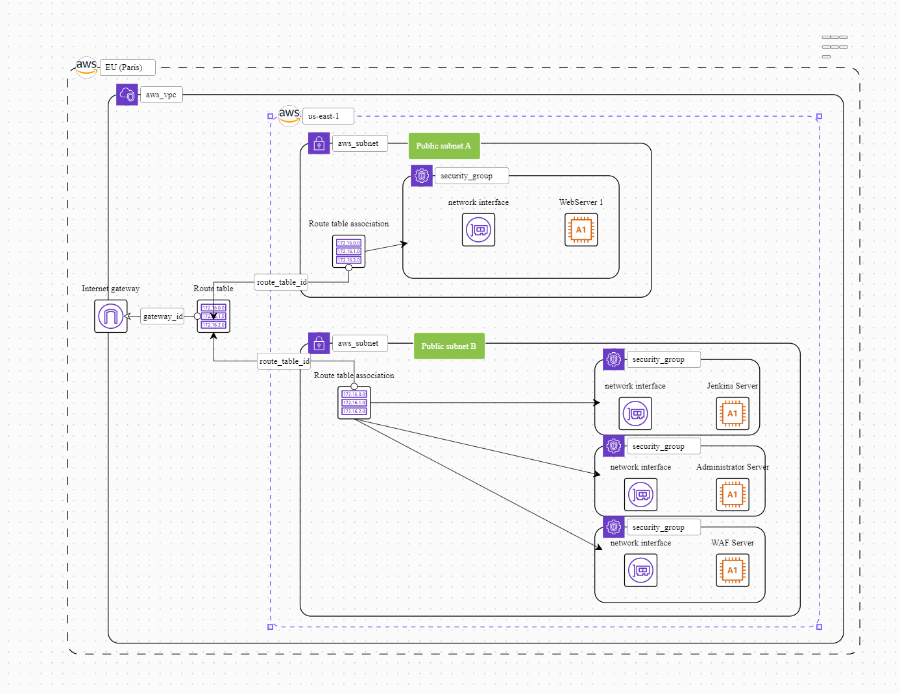

# DevSecOps with AWS Provider

[](LICENSE)

## Description

DevSecOps with AWS Provider is a project that combines infrastructure provisioning, configuration management, and pipeline automation using Terraform, Ansible, Jenkins, OWASP Dependency Check, SonarQube, WAF (Web Application Firewall) with ModSecurity module, CRS (Core Rule Set), Graylog, and Elasticsearch Filebeat. This project focuses on integrating security practices into the DevOps workflow while leveraging the AWS (Amazon Web Services) provider.

## Table of Contents

- [Installation](#installation)
- [Usage](#usage)
- [Architecture](#architecture)
- [Features](#features)
- [Roadmap](#roadmap)
- [Contributing](#contributing)
- [License](#license)

## Installation

1. Clone the repository:

```shell
git clone [https://github.com/your-username/your-repo.git](https://github.com/Light30599/DevSecOps-with-AWS-Provider.git)

```
2. Install the necessary dependencies:

Terraform: Installation Guide
3. Configure the necessary settings and credentials for AWS and other tools. Refer to the respective documentation for instructions.
4. Deploy the infrastructure using Terraform:

```shell
cd DevSecOps-with-AWS-Provider
terraform init
terraform apply
```

## Usage
1. Once the infrastructure is provisioned, access Jenkins and configure pipelines to automate your CI/CD workflows. Use the provided plugins like OWASP Dependency Check and SonarQube for security analysis.

2. Set up the WAF using ModSecurity and add the Core Rule Set (CRS) for enhanced security of your web application instances.

3. Visualize and analyze ModSecurity logs using Graylog. Connect it to Elasticsearch Filebeat to collect and ship logs for centralized monitoring and analysis.

## Architecture
The architecture of this project consists of the following components:

- Infrastructure provisioning: Terraform
- Configuration management: Ansible
- CI/CD automation: Jenkins
- Security analysis: OWASP Dependency Check, SonarQube
- Web Application Firewall: ModSecurity with Core Rule Set (CRS)
- Log visualization: Graylog
- Log shipping: Elasticsearch Filebeat
For a visual representation of the architecture, refer to the architecture.png file in the repository.




## Features
- Automated infrastructure provisioning using Terraform.
- Configuration management and instance management using Ansible.
- CI/CD automation and pipeline management using Jenkins.
- Security analysis for dependencies using OWASP Dependency Check.
- Code quality analysis and security scanning using SonarQube.
- Web Application Firewall with ModSecurity
